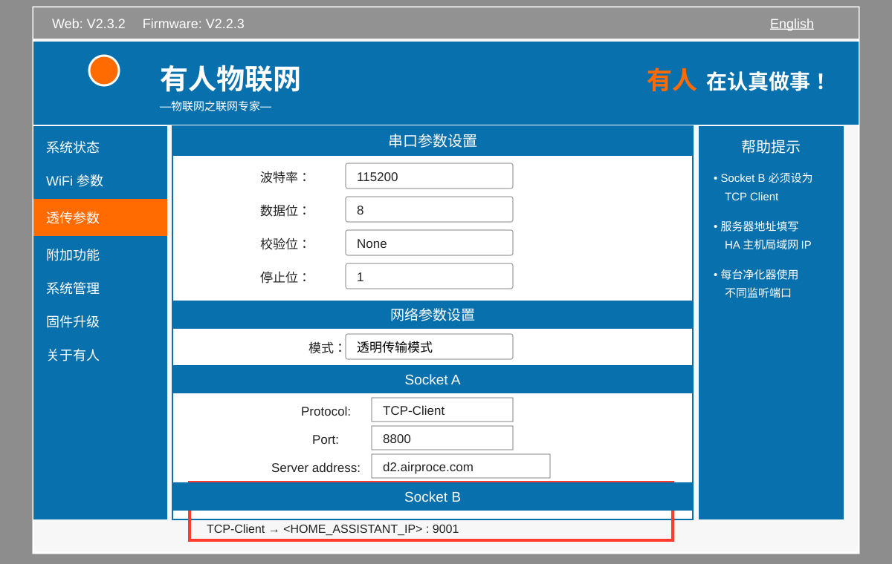

# AirProce for Home Assistant

**English** | [简体中文](README.zh-CN.md)

A native Home Assistant custom integration for AirProce air purifiers whose internal USR serial-to-network module exposes a second transparent TCP connection (Socket B).

The integration keeps Socket A connected to the official AirProce cloud so the official app can continue to work, while Socket B connects directly to Home Assistant for local state reporting and control.

**No MQTT broker or Home Assistant MQTT integration is required.**

AirProce product website: [https://airproce.net/](https://airproce.net/)

Verified models:

- **AI-300**
- **AI-600**

Other models may use different protocol frames and have not yet been verified.

## Essential prerequisite

> **This integration can only be used when the purifier's internal USR transparent-transmission management page is accessible.**

Before installing the integration, open:

```text
http://<PURIFIER_IP>:80
```

Common default credentials are:

```text
Username: admin
Password: admin
```

After login, the page should show a USR transparent-transmission interface containing both Socket A and Socket B settings. If this page cannot be opened, the credentials are unknown, or Socket B is not available, this integration cannot use the method documented here.

The following privacy-safe illustration is redrawn from a verified USR management page. The exact layout may vary slightly by firmware version:



## Native Home Assistant entities

Each purifier is represented as one Home Assistant device with native entities:

- `fan` — power, six hardware speeds, `auto`, and `sleep`
- temperature sensor
- humidity sensor
- PM2.5 sensor
- VOC sensor

The six hardware fan speeds are exposed through Home Assistant's standard fan percentage model. Home Assistant therefore displays six percentage steps, while the entity attribute `hardware_speed` reports the actual AirProce speed `1` through `6`.

Socket B disconnects and watchdog failures are reflected directly as entity availability. No MQTT Discovery layer is involved.

## Architecture

```text
Socket A -> AirProce official cloud
             official app remains available

Socket B -> Home Assistant TCP listener
             -> AirProce protocol parser
             -> native fan + sensor entities
```

All control and state handling stays local between the purifier and Home Assistant. After a command, the integration waits for the purifier ACK, requests state, and updates Home Assistant from the confirmed device response.

## Requirements

1. Home Assistant 2026.6 or later is recommended.
2. The purifier's USR module must be able to reach the Home Assistant LAN address and configured Socket B listening port.
3. Only one process can listen on a TCP port. Stop any previous standalone AirProce bridge before installing this integration.
4. You must be able to log in to the purifier's USR management page and configure Socket B manually.

MQTT is **not** a requirement.

## Installation

### HACS custom repository

1. Open HACS.
2. Add the following custom repository and select **Integration** as the category:

```text
https://github.com/Griddz/home-assistant-airproce-bridge
```

3. Install **AirProce**.
4. Restart Home Assistant.

### Manual installation

Copy:

```text
custom_components/airproce_bridge
```

into:

```text
/config/custom_components/airproce_bridge
```

Restart Home Assistant.

## Configuration

Open:

```text
Settings -> Devices & services -> Add integration
```

Search for:

```text
AirProce
```

The setup form is intentionally small. The main section contains only the settings normally required for a purifier:

- device name
- purifier model
- USR module IP address
- Socket B listening port

The collapsed **Advanced settings** section contains:

- stable device ID
- USR web port
- USR username and password
- USR login verification
- Socket B listening address
- watchdog timings

The stable device ID may be left blank during first setup. The integration then generates one from the USR IP and stores it in the config entry. After setup, keep the device ID unchanged so Home Assistant device/entity IDs remain stable.

### Configure Socket B

Configure the purifier's Socket B manually as:

```text
Protocol: TCP-Client
Server:   <HOME_ASSISTANT_LAN_IP>
Port:     <the listening port configured in AirProce, default 9001>
```

Keep Socket A pointed at the official AirProce cloud, for example:

```text
Protocol: TCP-Client
Server:   d2.airproce.com
Port:     8800
```

The USR credentials in Home Assistant are used only to verify that the embedded web interface is reachable and that the login works. The integration does not automatically modify USR settings.

## Adding a second or additional purifier

Each purifier needs its own config entry. The following values must be unique:

| Setting | First purifier example | Second purifier example |
|---|---|---|
| Stable device ID | `airproce_ai600_bedroom` | `airproce_ai300_livingroom` |
| USR module IP | `192.168.1.112` | `192.168.1.113` |
| Socket B listening port | `9001` | `9002` |

Multiple purifiers may share:

- the same Home Assistant LAN address
- the same default USR username and password
- the same watchdog settings

Configure the second purifier's Socket B as:

```text
Protocol: TCP-Client
Server:   <THE_SAME_HOME_ASSISTANT_LAN_IP>
Port:     9002
```

The config flow rejects a Socket B listening port that is already used by another AirProce config entry.

## Control and state behavior

- Manual hardware speeds are 1 through 6.
- Home Assistant exposes them through the standard fan percentage control with six steps.
- `auto` and `sleep` are fan preset modes.
- Setting a manual speed exits the preset mode.
- The first control byte for `auto` and `sleep` uses the latest valid fan context. This preserves the observed protocol behavior where the sleep command frame depends on the current fan state.
- After a command, the integration waits for the command ACK and immediately sends a status query. Home Assistant is then updated from the purifier's confirmed state rather than an optimistic state.

## Watchdog and availability

The purifier normally reports state approximately every 15 seconds. The default watchdog waits 45 seconds without a valid state frame before sending a status query. It retries once and, if no valid reply arrives, closes the suspected stale Socket B session.

The native fan and sensors become unavailable when Socket B disconnects or when the watchdog closes a stale connection. When the USR module reconnects, Home Assistant requests a fresh state automatically.

## Upgrading from version 0.1.x

Version 0.1.x used an internal MQTT bridge and MQTT Discovery. Version 0.2.0 removes that architecture and creates native Home Assistant entities directly.

On upgrade, the integration:

- removes legacy MQTT settings from the AirProce config entry
- attempts to clear the old retained AirProce MQTT Discovery topics if the Home Assistant MQTT publish service is available
- removes the matching old MQTT entity-registry entries
- keeps the same AirProce `device_id` and the same intended entity IDs where possible

If an old MQTT AirProce entity remains after upgrading, restart Home Assistant once more after confirming the old v0.1 bridge is no longer running. If a retained legacy Discovery message exists on a broker that Home Assistant can no longer reach, it must be cleared on that broker separately.

MQTT can be removed from the AirProce setup after migration; other Home Assistant devices may of course continue using MQTT independently.

## Migration from the standalone Python bridge

1. Stop the old Python script or systemd service.
2. Confirm that TCP port `9001`, or the selected listening port, is free on the Home Assistant host.
3. Install and configure AirProce.
4. Change USR Socket B to the Home Assistant LAN address and configured port.
5. Verify that the fan and sensors update promptly.

No MQTT configuration is needed.

## Privacy and security

The repository contains no private LAN addresses, MAC addresses, real usernames or passwords, room names, or user-specific paths. USR credentials are stored in the Home Assistant config entry and are redacted from diagnostics.

Review exported Home Assistant config entries and diagnostic files before publishing them.

## Known limitations

- USR parameters are not changed automatically because the embedded web form and HTTP interface vary by USR module and firmware.
- The control frames are reverse engineered and currently verified on AirProce AI-300 and AI-600 purifiers.
- Native Home Assistant fan entities represent discrete fan speeds as percentage steps; the exact hardware level remains available as the `hardware_speed` attribute.

## Code generation disclosure

All code in this repository was generated by **ChatGPT 5.6**.

## License

MIT
